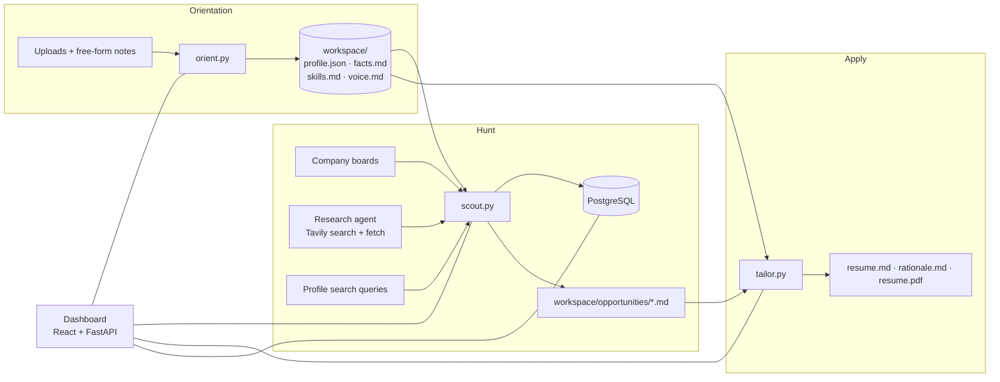

# Job Hunter


A personal job-search radar. Tell it who you are, and it finds open roles that fit, scores each one against your
real experience, and writes a tailored, fact-checked resume for the ones you pick.

- **Orientation:** upload your resume, LinkedIn export, or any document about your work, then talk or type freely about
  what you want next. The model drafts your evidence file, search plan, scoring rubric, and writing voice. You review and edit all of it.
- **Discovery:** company job boards, a research agent that searches and verifies live postings (Tavily), and saved search queries.
- **Qualification:** every fresh posting is scored 0-100 against your background, with strengths, gaps, and location checks.
- **Tailoring:** a resume and rationale drawn only from your verified facts, checked by a lint gate, and rendered to PDF.

---

## How it works



Every model call goes through `scripts/llm.py`, which speaks to **OpenRouter** (any model with structured outputs) or to
your local **Claude Code** login. Pick one in the dashboard; you can switch any time.

---

## Install on a Mac (step by step)

Plan on about 15 minutes. You need macOS 13 or later (Apple Silicon or Intel), an admin password for Homebrew, and a credit card for OpenRouter (a few dollars of credit goes a long way, or use your CLAUDE CODE subscription on localhost). 

Run each command in **Terminal**
(Applications → Utilities → Terminal), one block at a time.

### 1. Install Homebrew

[Homebrew](https://brew.sh) installs everything else. Skip this step if `brew --version` already prints a version.
If you don't have Apple's command line tools yet, the installer adds them too (they include `git`); accept the popup if
one appears.

```bash
/bin/bash -c "$(curl -fsSL https://raw.githubusercontent.com/Homebrew/install/HEAD/install.sh)"
```

On Apple Silicon Macs, put Homebrew on your PATH (the installer prints these same two lines at the end):

```bash
echo 'eval "$(/opt/homebrew/bin/brew shellenv)"' >> ~/.zprofile
```

```bash
eval "$(/opt/homebrew/bin/brew shellenv)"
```

Check it worked:

```bash
brew --version
```

### 2. Install uv, Task, and Bun

| Tool | Why |
|---|---|
| [uv](https://docs.astral.sh/uv/) | Runs the Python scripts and installs their packages (and Python itself) automatically |
| [Task](https://taskfile.dev) | Runs the project's commands (`task dev`, `task install`, ...) |
| [Bun](https://bun.sh) | Installs and runs the dashboard |

```bash
brew install uv go-task oven-sh/bun/bun
```

Check all three print a version:

```bash
uv --version && task --version && bun --version
```

### 3. Install and start PostgreSQL

The app stores every posting it finds in PostgreSQL.

```bash
brew install postgresql@18
```

```bash
brew services start postgresql@18
```

Check it is running. You should see `accepting connections`:

```bash
"$(brew --prefix postgresql@18)/bin/pg_isready"
```

Homebrew's PostgreSQL lets your macOS user connect without a password, which matches the app's defaults (host
`localhost`, port `5432`, your macOS username). The app creates its own database for you in step 9.

> [!TIP]
> Already running PostgreSQL another way (Postgres.app, Docker) on port 5432? You can use it instead: enter its port,
> user, and password in the Database step. If both want port 5432, stop one of them.

### 4. Optional extras

**agent-browser** reads job postings that only load with JavaScript, and renders resume PDFs. Without it, those postings
keep their short snippet, and PDFs fall back to Google Chrome if you have it installed.

```bash
brew install agent-browser
```

```bash
agent-browser install
```

**Claude Code** lets you run every model call on a Claude subscription instead of OpenRouter. Install it, run `claude`
once, and sign in:

```bash
brew install --cask claude-code
```

### 5. Get your API keys

| Key | Where | Notes |
|---|---|---|
| **OpenRouter** | [openrouter.ai](https://openrouter.ai): sign up, add credit under **Credits**, then create a key under **Keys** | Starts with `sk-or-`. Skip it if you'll only use Claude Code. |
| **Tavily** | [tavily.com](https://tavily.com): sign up, copy the key from the dashboard | Starts with `tvly-`. Powers job search. |

Keep both handy; you'll paste them into the app in step 9.

### 6. Download Job Hunter

Clone the project into your home folder and step into it:

```bash
git clone https://github.com/sid-newby/job-hunter.git ~/job-hunter
```

> [!NOTE]
> While the repository is private, cloning needs collaborator access and a GitHub sign-in. Run `brew install gh`, then
> `gh auth login` (choose **GitHub.com → HTTPS → Login with a web browser**), then the clone command above.

```bash
cd ~/job-hunter
```

### 7. Install the project

This creates your settings file from the template (`.env.example` → `.env`) and installs the dashboard's packages:

```bash
task install
```

### 8. Start the app

```bash
task dev
```

The first start takes a minute while uv downloads Python and the packages. When you see `Uvicorn running on
http://127.0.0.1:58880` and Vite's `Local: http://localhost:58888/`, open **http://localhost:58888** in Chrome or Safari.

Leave this Terminal window open while you use the app. Press `Ctrl+C` in it to stop.

### 9. Walk through orientation

The first screen is a four-step wizard.

1. **Model & keys**
   - Choose **OpenRouter** (paste your `sk-or-` key) or **Claude Code** (no key needed).
   - Leave the suggested models, or pick others from the list. Each shows its price and whether it supports tools.
   - Paste your Tavily key, click **Save**, then **Test connection** and **Test Tavily** (uses one search credit).
2. **Database**: leave the defaults unless you changed PostgreSQL in step 3, then click **Save & create database**.
3. **About you**
   - Drag in your resume and anything else about your work: LinkedIn PDF export, performance reviews, portfolio write-ups,
     recommendation letters (PDF, DOCX, Markdown, text, HTML).
   - In the big box, write or dictate (mic button) what you've done, what you want next, where you'll work, salary floor,
     deal-breakers, and companies you like. More detail means better searches and better resumes.
4. **Your profile**
   - Click **Build my profile** and watch the log (a minute or two).
   - Review each tab:
     - **Profile** holds your target cities, title keywords, companies, search scopes, and scoring rubric.
     - **Facts** holds your verified career facts. Fix anything wrong and resolve every `[[CONFLICT: ...]]` line.
     - **Voice** sets how your resumes should sound.
     - **Skills** maps each skill to its evidence.
   - Click **Save**, then **Finish**.

### 10. Run your first hunt

Click **Hunt Opportunities**, pick a scope (or **All scopes**), optionally type a steer ("remote only", a company's
Greenhouse or Ashby board URL, quoted titles), and start. The log shows each search, fetch, and score. Matches land in
the **Filed** tab (score 70+), **In Review** (50-69), or **Weak Fit**.

> [!NOTE]
> With the default `openai/gpt-6-luna:batch` scoring model, OpenRouter processes the scores as a batch. That can take
> minutes or, when OpenRouter is busy, hours. Keep `task dev` running until the job finishes, or switch the **Qualify**
> model to `openai/gpt-6-luna` in Settings (gear icon) for immediate results at twice the price.

### 11. Tailor a resume

Open a filed role and click **Tailor**. Add any inside knowledge or angle you want, then generate. You get a resume, a
rationale that traces every claim to your facts, and a PDF download button.

### Everyday use

| To... | Do this |
|---|---|
| Start the app | `cd ~/job-hunter && task dev`, then open http://localhost:58888 |
| Stop the app | `Ctrl+C` in its Terminal window |
| Change keys, models, or database | Gear icon → Settings |
| Update your profile | Gear icon → Settings → Profile, or **Re-run orientation** |
| Get the latest version | `cd ~/job-hunter && git pull && task install` |
| Stop PostgreSQL | `brew services stop postgresql@18` |

### Troubleshooting

| Symptom | Fix |
|---|---|
| `command not found: brew`, `task`, `uv`, or `bun` | Close and reopen Terminal. On Apple Silicon, rerun the two `brew shellenv` lines from step 1. |
| Database step says `connection refused` | `brew services start postgresql@18`, then check with the `pg_isready` command from step 3. |
| Database step says `role "..." does not exist` or `password authentication failed` | You're reaching a different PostgreSQL (often Docker). Enter its user and password, or its port. |
| `task dev` says a port is in use | `task kill-ports`, then `task dev` again. |
| **Test connection** lists problems | Pick a model that shows the **structured** chip; the Discovery model also needs **tools**. `:batch` models only work for Qualify. |
| **Test connection** says the key was rejected | Re-copy the OpenRouter key and check you have credit. |
| Tailor stops with "unresolved conflict markers" | Open Settings → Profile → Facts and resolve every `[[CONFLICT: ...]]` line. |
| No PDF after tailoring | Install agent-browser (step 4) or Google Chrome. |
| No mic button in About you | Your browser lacks speech recognition; use Chrome or Safari. |
| A hunt finds nothing new | Everything found was already evaluated. Try another scope, add companies or queries in your profile, or steer the hunt. |

---

## Models

Each part of the pipeline has a role, and each role can use a different model.

| Role | Used by | Needs tools | OpenRouter default |
|---|---|---|---|
| `orient` | Profile building | no | `openai/gpt-6-luna` |
| `discovery` | Research agent (search + fetch loop) | **yes** | `openai/gpt-6-luna` |
| `qualify` | Scoring every posting | no | `openai/gpt-6-luna:batch` |
| `tailor` | Resume + rationale | no | `openai/gpt-6-luna` |

> [!NOTE]
> Model ids ending in `:batch` run on OpenRouter's asynchronous [Batch API](https://openrouter.ai/docs/batch-quickstart):
> half the price, but results can take up to 24 hours. The scout submits all qualifications as one batch and polls until
> it finishes. Batch models can't drive the discovery agent's tool loop or anything interactive, so keep them on `qualify`.

Resolution order for a role's model: `OPENROUTER_<ROLE>_MODEL`, then `OPENROUTER_MODEL`, then the default above
(`CLAUDE_<ROLE>_MODEL` / `CLAUDE_MODEL` in Claude Code mode, default `claude-opus-4-8`).

---

## Configuration

Settings live in `.env` (created from [`.env.example`](.env.example)); the dashboard edits it for you. Values already
set in your shell take precedence over `.env`.

| Variable | Default | Purpose |
|---|---|---|
| `LLM_PROVIDER` | `openrouter` | `openrouter` or `claude-code` |
| `OPENROUTER_API_KEY` | | OpenRouter key |
| `OPENROUTER_MODEL`, `OPENROUTER_<ROLE>_MODEL` | see above | Model per role |
| `CLAUDE_MODEL`, `CLAUDE_<ROLE>_MODEL` | `claude-opus-4-8` | Model per role in Claude Code mode |
| `TAVILY_API_KEY` | | Web search for discovery |
| `PGHOST` / `PGPORT` / `PGDATABASE` / `PGUSER` / `PGPASSWORD` | `localhost` / `5432` / `job_hunter` / OS user / none | PostgreSQL |
| `<ROLE>_EFFORT` | discovery `medium`, qualify `low`, tailor `high`, orient `high` | Reasoning effort |
| `SCOUT_CONCURRENCY` | `8` | Parallel qualification calls (non-batch models) |
| `SCOUT_DISCOVERY_MAX_TURNS` | `40` | Tool-loop budget for the research agent |
| `LLM_BATCH_POLL_S` / `LLM_BATCH_TIMEOUT_S` | `30` / `86400` | Batch polling interval and give-up time |
| `JOB_HUNTER_WORKSPACE` | `./workspace` | Where your personal data lives |

---

## Your workspace

Everything personal lives in `workspace/`, which git ignores.

| Path | What it is |
|---|---|
| `profile.json` | Contact details, target metros, title keywords, company boards, search scopes, scoring rubric, resume rules |
| `facts.md` | Your verified career facts with stable IDs; the only source of numbers and titles for resumes |
| `skills.md` | Skills index linked to the facts that prove them |
| `voice.md` | Your writing voice, plus `## Banned terms` and `## Use at most once` lists the resume lint enforces |
| `recommendations.md` | Testimonials found in your documents |
| `interview.md` | Your free-form notes from orientation |
| `uploads/` | Documents you uploaded, with text extractions in `uploads/.text/` |
| `opportunities/` | One Markdown file per posting, plus `*.resume.md`, `*.rationale.md`, `*.resume.pdf` |
| `target_urls.txt` | Optional: posting URLs to always evaluate, one per line |
| `.history/` | Backups taken each time orientation rebuilds your profile |

> [!IMPORTANT]
> Orientation marks contradictions between your documents with `[[CONFLICT: ...]]` in `facts.md`. Tailoring refuses to
> run until you resolve them, so the resume never picks a number for you.

---

## Commands

| Command | What it does |
|---|---|
| `task install` | Installs dashboard dependencies, creates `.env` from the example |
| `task dev` | Frees ports 58880/58888 and runs the API and dashboard together |
| `task ui:server` / `task ui:dev` | Runs just the API or just the dashboard |
| `task ui:build` | Type-checks and builds the dashboard |
| `task db:init` | Creates the database and tables from the command line |
| `task orient -- check` | Verifies your provider key and models (one tiny call) |
| `task orient -- build` | Builds the profile from `workspace/uploads/` and `workspace/interview.md` |
| `task scout -- --scope all` | Live hunt. Spends Tavily credits and model calls. `--scope <key>`, `--query "..."`, `--metros a,b`, `--model`, `--json` |
| `task scout -- --retriage [COMPANY]` | Re-routes low scores to weak fit or noise |
| `task scout -- --refetch [SLUG]` | Re-renders postings whose text is only a stub |
| `task tailor -- workspace/opportunities/Acme/role.md` | Resume, rationale, and PDF for one posting (`--revise "..."`, `--evidence PATH`, `--lint-only FILE`) |
| `task reindex` | Rebuilds database rows from `workspace/opportunities/` |

`task dev` runs the API and the dashboard together through Task's parallel `deps`.

---

## Costs

The dashboard's cost view totals every model call and Tavily credit from the `telemetry_costs` table. OpenRouter calls
record the actual cost OpenRouter reports; Claude Code calls record zero (subscription) with the nominal list price in
the row's metadata. Tavily searches and extracts record one credit each (extracts are billed per five URLs).

---

## Project layout

```text
scripts/
  config.py            paths, .env, database settings, model per role
  llm.py               OpenRouter / Claude Code switch, Tavily tools, batch submit + poll
  claude_agent.py      Claude Agent SDK backend
  tavily.py            search and extract
  db.py                database creation, schema, telemetry
  candidate_profile.py profile.json schema
  artifacts.py         uploads and text extraction
  orient.py            orientation build
  scout.py             discovery + qualification
  tailor.py            resume + rationale + lint
  render_cv_pdf.py     resume PDF
  browser_extract.py   agent-browser fallback for JavaScript postings
ui/
  server.py            FastAPI
  src/                 React + MUI dashboard and orientation wizard
```
